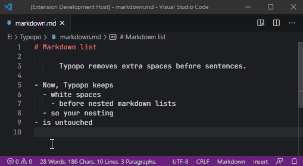
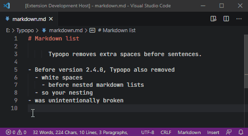

# Changelog for Typopo VS Code extension

## 1.3.0 // 2023-05-01

### ✨ New features
- When no text is selected and you run `fixTypos`, the typos get fixed for the current line.

### 📦️ Updates
- Bump devDependencies to their latest versions

## 1.2.2 // 2022-07-12

### 📦️ Updates
- Bump Typopo package to its latest version ([2.5.4](https://github.com/surfinzap/typopo/releases/tag/2%2F5%2F4))
- Bump devDependencies to their latest versions

## 1.2.1 // 2022-01-17

### 📦️ Updates
- Bump Typopo package to its latest version ([2.5.3](https://github.com/surfinzap/typopo/releases/tag/2%2F5%2F3))
- Bump devDependencies to their latest versions

## 1.2.0 // 2021-06-09

### ✨ New features
New configuration option to keep Markdown code blocks in your Markdown files:
- `keepMarkdownCodeBlocks: true` when you want to keep Markdown code blocks in your Markdown files
- `keepMarkdownCodeBlocks: false` want to fix grave accents (`) in generic texts to single quotes 

### 📦️ Updates
- Bump Typopo package to its latest version ([2.5.0](https://github.com/surfinzap/typopo/releases/tag/2%2F5%2F0))

## 1.1.0 // 2020-11-25
### New features
New configuration option to remove/keep whitespaces before nested markdown lists. By default, whitespaces before markdown list are kept.

**Typopo now keeps nested lists:**

**Optionally, you can set whitespaces before nested markdown lists to be removed:**

## 1.0.3 // 2020-11-01
### Updates
- Bump Typopo package to its latest version ([2.3.7](https://github.com/surfinzap/typopo/releases/tag/2%2F3%2F7))

## 1.0.2 // 2020-10-03
This version has no functional changes. I’ve repacked the distribution so it includes all dependencies.

## 1.0.1 // 2020-10-03
### Updates
- Bump Typopo package to its latest version ([2.3.6](https://github.com/surfinzap/typopo/releases/tag/2%2F3%2F6))

## 1.0.0 // 2020-09-01
This version has no functional changes, but I’ve updated the icon and README.md, so it looks like a real extension.
- Add VS Code extension icon
- Update README.md 
- Add LICENSE.txt

## 0.0.4 // 2020-08-25

### Fixes
- Change keyboard for shortcut from `Option+CMD+T` to `Ctrl+CMD+T`. Previous shortcut was colliding with `Close Other Editors in Group`.

## 0.0.3 // 2020-08-20
Fix typos in the selected text. As of this version you can:
- set your default language (en-us, de-de, cs, sk, rue)
- choose whether to remove empty lines the text