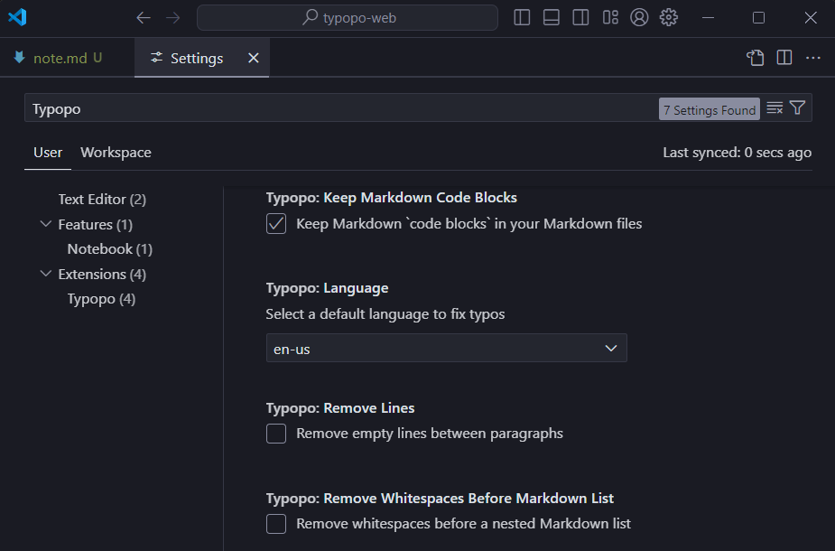

# Typopo extension for VS Code  

> Fix frequent microtypography errors in multiple languages in VS Code with Typopo. Write neat texts without bothering about typography rules. Typopo works for English, German, Slovak, Czech and Rusyn language.

## Use 
1. Select text you wish to fix
2. Fix it, either by `Typopo: Fix Typos` via menu or via `Ctrl+Alt+T` (Win) or `Ctrl+Cmd+T` (Mac).

## Settings
You can set a default language and choose whether you wish to keep or remove empty lines. You can fix microtypography for:
- English,
- German,
- Rusyn,
- Czech,
- Slovak texts. 

## Features
Typopo fixes punctuation:
* double quotes (and accidentally-typed punctuation related to the use of double quotes)
* double primes
* single quotes (with an assumption they are used as [secondary](https://en.wikipedia.org/wiki/Quotation_mark#Summary_table_for_various_languages) and in pairs)
* single primes
* apostrophes
* hyphens & dashes
	* between words with a proper spacing per locale
	* between ordinal and cardinal numbers
	* within date
	* between percentage range
* period & ellipsis

Typopo fixes whitespace characters:
* removes extra white spaces
	* at the beginning and the end of sentences (leading and trailing spaces)
	* between words and paragraphs
	* before or after a punctuation
	* around an ellipsis and an aposiopesis (where applicable)
	* between a number sign (#) and a number
	* before ordinal indicators (e.g. 1 st → 1st)
* removes empty lines
* fixes non-breaking spaces
	* removes nbsp between multi-letter words
	* adds nbsp
		* after one-word prepositions
		* around “×”
		* after “&”
		* after cardinal numbers
		* after ordinal numbers
		* ordinal Roman numerals
		* after name initials (i.e. Philip K. Dick)
		* after common single-word and multiple-word abbreviations
	* replaces space with nbsp before % (percent), ‰ (per mille), ‱ (permyriad)

Typopo fixes words:
* accidental uPPERCASE
* spelling of e.g., i.e., a.m. and p.m.
* ISSN and ISBN formatting

Typopo fixes symbols:
* multiplication sign (×)
* section sign (§)
* copyright (©)
* sound recording copyright (℗)
* registered trademark (®)
* trademark (™)
* plus-minus sign (+-, -+ → ±)
* square and cube exponents (e.g. 100 µm² → 100 µm², 50 km³ → 50 km³)

Describe specific features of your extension including screenshots of your extension in action. Image paths are relative to this README file.

## Further use
- check out [Typopo as a free web app](https://typopo.org).
- use [Typopo library as an NPM package](https://www.npmjs.com/package/typopo)
- check out [Typopo’s code at Github](https://github.com/surfinzap/typopo)

## Release Notes
Check out the [changelog](CHANGELOG.md).

## Support
While being free and open source, if you find it useful, please consider supporting it by donating via [PayPal](https://www.paypal.com/paypalme/branosandala) or [Patreon](https://www.patreon.com/branosandala).

## Feedback
Have you found a bug? Do you have an idea for a feature request? You’re more then welcome to [submit an issue here on GitHub](https://github.com/surfinzap/typopo/issues/new/choose).

If you prefer to reach out me via email, feel free to drop me a line at <help@typopo.org>.

## License
Licensed under MIT license. (See [LICENSE.txt](LICENSE.txt).)

