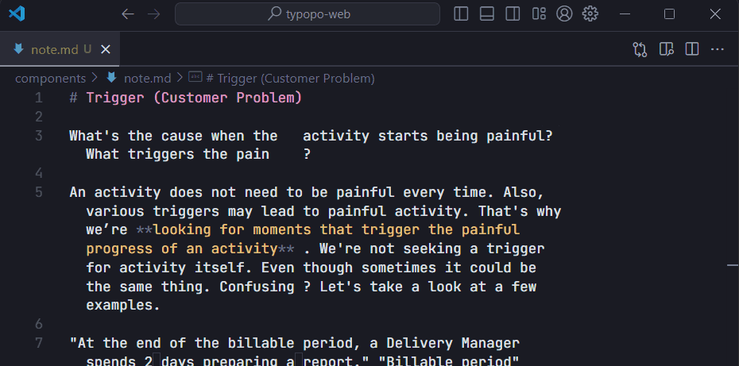

# Typopo extension for VS Code 

 

> Fix frequent microtypography errors in multiple languages in VS Code with Typopo. Write neat texts without bothering about typography rules. Typopo works for English, German, Slovak, Czech and Rusyn language.

## Fix typos in code

Fix your texts with Typopo, so you don’t need to escape \\"dumb quotes\\" or place \&nbsp;. Typopo will place all the relevant characters for you.

## Fix typos in Markdown notes

Write neat notes without bothering about all the typography rules.

## Contents
- [Typopo extension for VS Code](#typopo-extension-for-vs-code)
  - [Fix typos in code](#fix-typos-in-code)
  - [Fix typos in Markdown notes](#fix-typos-in-markdown-notes)
  - [Contents](#contents)
  - [Use](#use)
  - [Settings](#settings)
  - [Features](#features)
  - [Further use](#further-use)
  - [News & Releases](#news-releases)
  - [Support](#support)
  - [Feedback](#feedback)
  - [License](#license)

## Use 
1. Select text you wish to fix
2. Fix it, either by `Typopo: Fix Typos` via menu or via `Ctrl+Alt+T` (Win) or `Ctrl+Cmd+T` (Mac).

## Settings
You can set:
- a default language for typography rules:
  - English
  - German
  - Rusyn
  - Czech
  - Slovak
- choose to keep/remove empty lines
- choose to keep/remove whitespaces before a nested Markdown list

## Features
Typopo fixes microtypography hickups in five languages:
- English
- German
- Czech
- Slovak
- Rusyn

Typopo fixes punctuation:
- double quotes (and accidentally-typed punctuation related to the use of double quotes)
- double primes
- single quotes (with an assumption they are used as [secondary](https://en.wikipedia.org/wiki/Quotation_mark#Summary_table_for_various_languages) and in pairs)
- single primes
- apostrophes
- hyphens & dashes
	- between words with a proper spacing per locale 
	- between ordinal and cardinal numbers (e.g. 1–3 eggs)
	- within date (e.g. 2020–08–04)
	- between percentage range (e.g. 20–30 %)
- period & ellipsis

Typopo fixes whitespace characters:
- removes extra white spaces
	- at the beginning and the end of sentences (leading and trailing spaces)
	- between words and paragraphs
	- before or after a punctuation (where applicable)
	- around an ellipsis and an aposiopesis (where applicable)
	- between a number sign (#) and a number
	- before ordinal indicators (e.g. 1 st → 1st)
- removes empty lines
- fixes non-breaking spaces
	- removes a nbsp between multi-letter words
	- replaces a space with a nbsp
		- after one-word prepositions
		- around “×”
		- after “&”
		- after cardinal numbers
		- after ordinal numbers
		- ordinal Roman numerals
		- after name initials (i.e. Philip K. Dick)
		- after common single-word and multiple-word abbreviations
		- before % (percent), ‰ (per mille), ‱ (permyriad)

Typopo fixes words:
- accidental uPPERCASE
- spelling of e.g., i.e., a.m. and p.m.
- ISSN and ISBN formatting

Typopo fixes symbols:
- multiplication sign (2 x 3 → 2 × 3)
- section sign (§)
- copyright ((c)2020 → © 2020)
- sound recording copyright ((p)2020 → ℗ 2020)
- registered trademark (Brand(r) → Brand®)
- trademark (Brand(tm) → Brand™)
- plus-minus sign (+-, -+ → ±)
- square and cube exponents (e.g. 100 µm² → 100 µm², 50 km³ → 50 km³)

## Further use
- [Typopo as a free web app](https://typopo.org)
- [Typopo as an NPM package](https://www.npmjs.com/package/typopo)
- [Typopo’s source code at Github](https://github.com/surfinzap/typopo)

## News & Releases
Check out the [changelog](CHANGELOG.md) for what’s has been released.

[Subscribe to Typopo Newsletter](https://buttondown.email/Typopo) to be the first to know about all the new features and improvements.

## Support
If you love Typopo and you find it helpful, [support the project via Patreon](https://www.patreon.com/branosandala). Or, give it a nice starry review here at marketplace. 

Your support will let me continue improving Typopo ecosystem—[the app](https://typopo.org), [NPM package](https://www.npmjs.com/package/typopo) and [VS Code Extension](https://marketplace.visualstudio.com/items?itemName=brano.typopo-vscode). Thanks!

## Feedback
Have you found a bug? Do you have an idea for a feature request? You’re more then welcome to [submit an issue here on GitHub](https://github.com/surfinzap/typopo-vscode/issues/new/choose).

If you prefer to reach out me via email, feel free to drop me a line at <help@typopo.org>.

## License
Licensed under MIT license. (See [LICENSE.txt](LICENSE.txt).)

