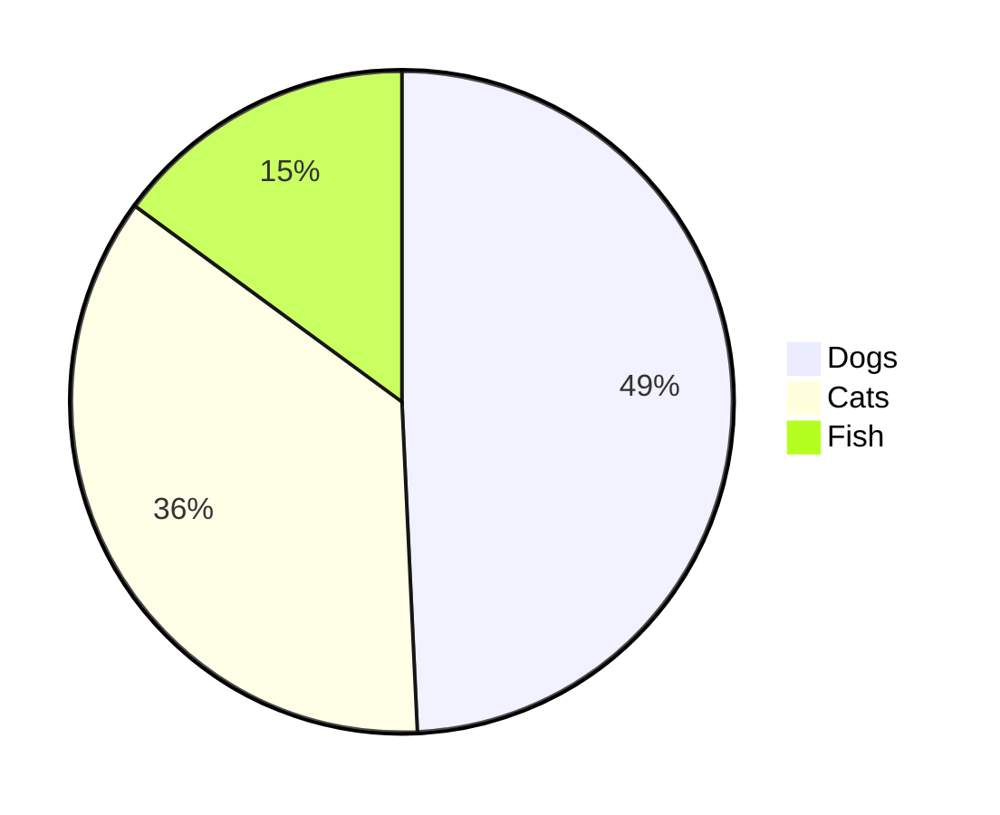
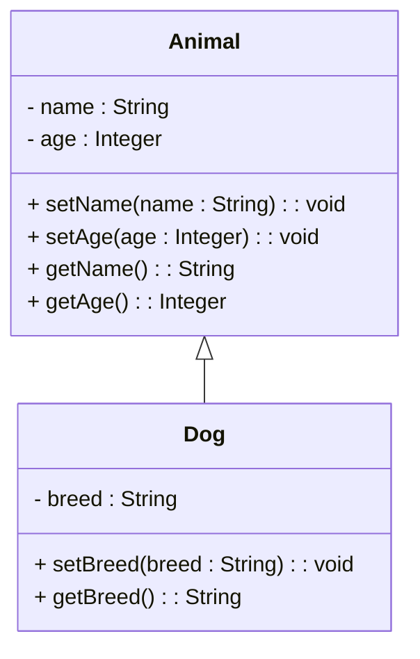

# Header 1...

This is a **bold text** and an _italic text_ and also an `inline code` or a [link](http://example.com).

## "Header" 2

Here's a list of items:

- Item 1...
- Item 2...
- Item 3...
  - Item 3.1

Checkboxes

- [ ] "Checkbox"
- [x] Checkbox "checked"

### Header 3

This is a blockquote:

> Lorem ipsum dolor sit amet, consectetur a `code` elit. Vivamus maximus sit amet "mauris" nec lacinia. Fusce bibendum magna sed ex vestibulum, eu tincidunt risus sodales.
>
> lorem "ipsum"

#### Header 4

This is a table:

| Column 1 | "Column 2" | Column 3 |
| -------- | ---------- | -------- |
| Cell 1   | Cell 2...  | Cell 3   |
| Cell 4   | `"Cell"` 5 | Cell 6   |

##### Header 5

This is a code block:

```python
def hello_world():
    print("Hello, World!")

hello_world()
```

This is a horizontal rule:

---

This is some more text. You can also create [links](https://www.example.com) and include images:


And here's some inline code: `print("Hello, World!")`

And here's some ~~"strikethrough"~~ text.




